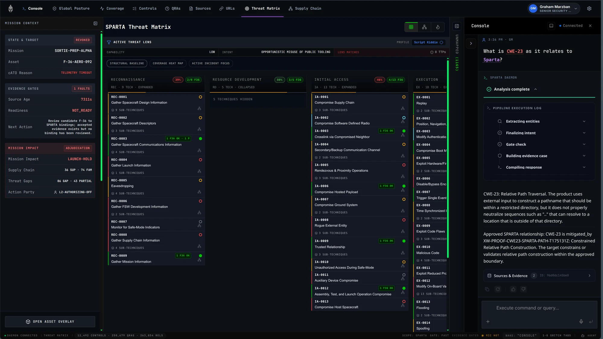
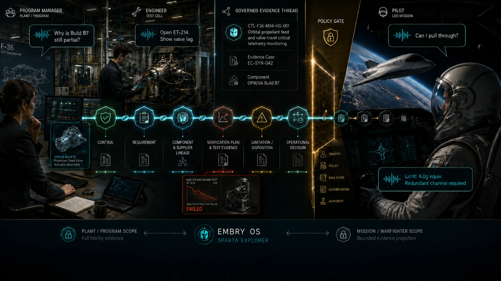
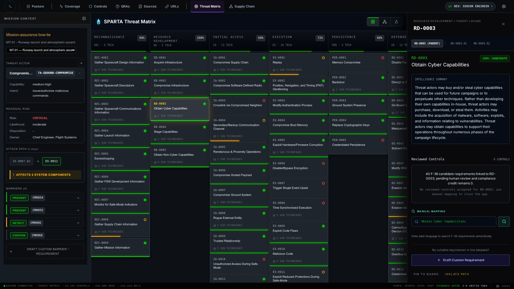
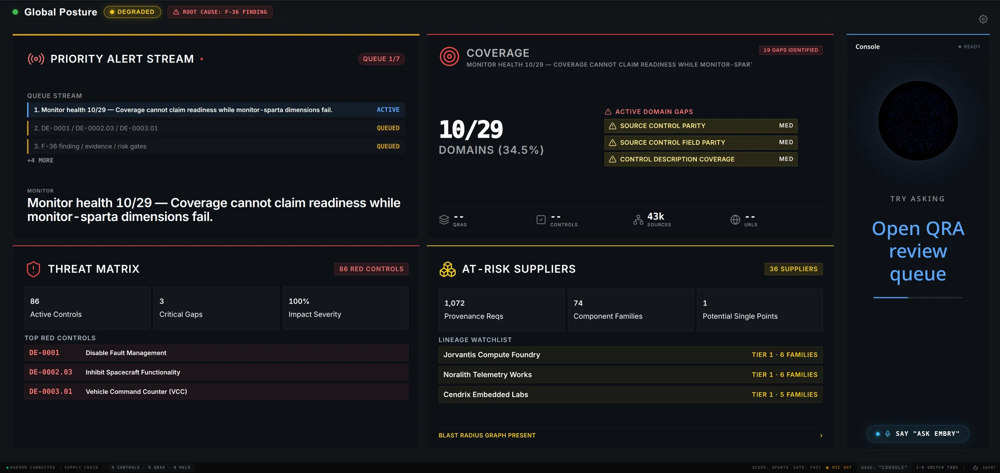
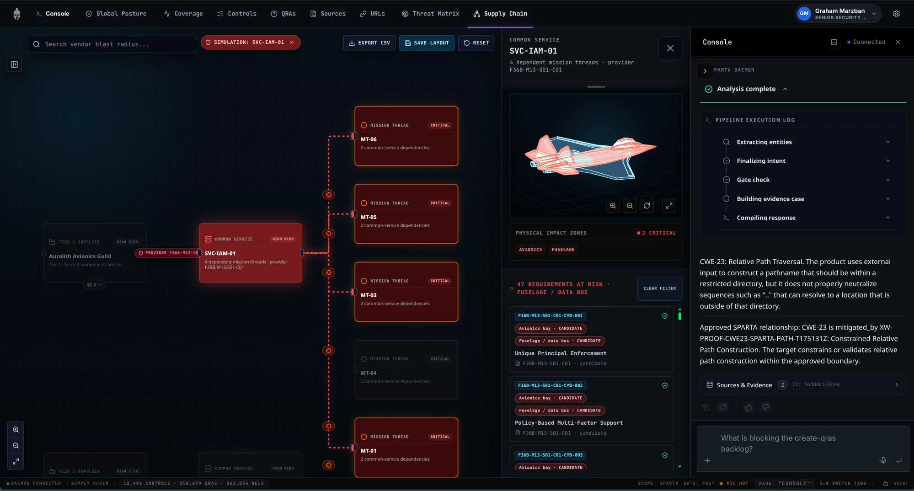
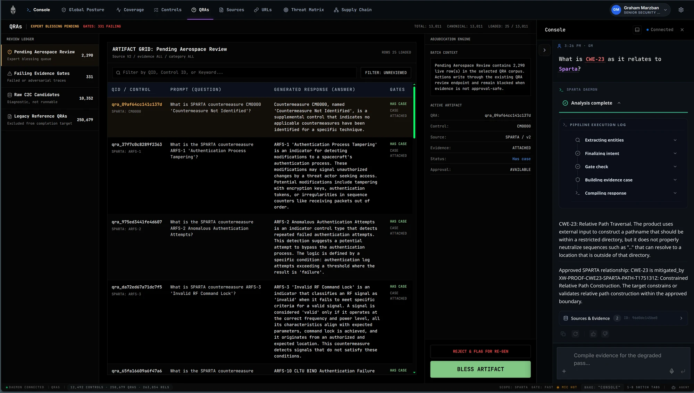
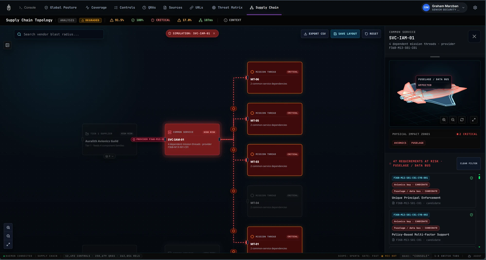
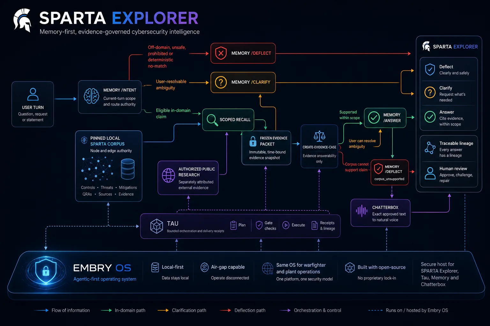

#  Sparta Explorer

**Trace a space-cyber conclusion from framework guidance to program evidence and human review—without letting AI turn relevance into authority.**

Sparta Explorer is a local-first investigation workspace for compliance, security,
engineering, supplier, test, program, and assessment teams. It brings
[Aerospace SPARTA](https://sparta.aerospace.org/) knowledge beside program
requirements, component and supplier lineage, engineering artifacts, test evidence,
and human review state.

**Sparta Explorer turns scattered space-cyber, engineering, supplier, and test
evidence into one inspectable decision thread, so teams can find what blocks
signoff faster without giving the model approval authority.**

Start with a threat, control, requirement, component, supplier, test, or finding.
Sparta Explorer shows the relevant evidence, how the relationships were derived,
what remains uncertain, and which decision still belongs to a person.

> **About this repository.** This is the public product overview for Sparta
> Explorer — the README and its screenshots, nothing else. The implementation,
> data pipelines, evidence receipts, and issue history live in a private
> repository, and the underlying graph-memory engine lives in a separate private
> repository. Documents referenced below (architecture notes, evidence proofs,
> contribution and security policy) are part of that private repository and are
> named here for context rather than linked. Design partners can be given access
> on request.

It helps a team answer three practical questions:

- **Why do we believe this?**
- **What is missing, stale, disputed, or still only a candidate?**
- **Who is allowed to decide?**

The project is in the late-stage prototype phase. The core prepared-host
investigation experience is working; the remaining work is concentrated in current
demo health, response-route convergence, independent corpus review, clean-machine
packaging, and deployment governance.

> **Collaboration stage:** ready for design-partner conversation, architecture
> walkthrough, workflow evaluation, co-design, and prepared-host technical
> sessions. Live demonstrations use a mandatory session preflight so stale
> evidence is shown as degraded rather than presented as current.

## The Product in One View

### Threat Matrix



*Follow a synthetic F-36 requirement into SPARTA tactic coverage, mapping
provenance, review state, and the next unresolved decision. Candidate coverage
stays separate from compliance credit. Live local capture, 2026-07-30, source
commit `26523b2a4`.*

## At a Glance

| Reader | What Sparta Explorer helps them do |
| --- | --- |
| **Compliance officer or assessor** | Trace an obligation to its supporting evidence, gaps, freshness, and review state without turning visibility into approval. |
| **Cybersecurity analyst or engineer** | Inspect how a SPARTA-to-program relationship was derived and whether it is native, persisted, inferred, reviewed, or still a candidate. |
| **Program, supplier, or mission lead** | See which evidence thread is blocking a decision and follow the impact through requirements, components, suppliers, tests, and findings. |
| **Platform or integration team** | Shape how the investigation layer connects to GRC, OSCAL, PLM, identity, local inference, and policy-bounded deployment. |

## Built on Embry OS

**Sparta Explorer is the assurance workbench inside Embry OS: one planned local
operating foundation, designed for disconnected and policy-bounded
environments, intended to connect the plant that builds and sustains a system
with the warfighter program that depends on it.**

The plant and warfighter-program profiles share infrastructure and evidence
continuity, but not implicit authority. Identity, data, network, review, and
decision boundaries remain mission-separated. Plant-side engineering, supplier,
machine-test, configuration, and maintenance evidence can inform mission
assurance without silently becoming operational truth.

Embry OS is not flight-control software, and neither Embry OS nor Sparta
Explorer authorizes an operational, compliance, certification, or risk decision.
The system makes the evidence behind those decisions easier to inspect,
challenge, repair, and keep current.



*One mission-separated operating environment from plant evidence to
warfighter-program assurance. Conceptual synthetic illustration; not a live
product capture, operational claim, or proof of response-contract closure.*

| Plant profile | Warfighter-program profile |
| --- | --- |
| Supplier records, configuration, manufacturing evidence, machine tests, anomalies, maintenance, and corpus health. | Mission threats, control relationships, requirements, verification evidence, posture, and unresolved operational limitations. |
| **Shared:** governed memory, evidence lineage, monitoring, orchestration, local inference, and human review. | **Separated:** identity, data access, release state, approval scope, and decision authority. |

## The Synthetic F-36 Demonstration

F-36 is a fictional aerospace program world used to test a difficult systems
question: can one evidence thread serve program, engineering, supplier, test,
and operational readers without collapsing their authority boundaries?

The useful behavior is separation. A program manager can ask whether a control is
covered, partial, missing, stale, or blocked. An engineer can enter through a
component, supplier, verification method, test record, anomaly, waiver, or
unresolved limitation. An operational user can ask a mission-scoped question only
when the governed path can prove support for the specific variant, environment,
date range, and context.

<details>
<summary>Candidate-versus-reviewed example</summary>



*RD-0003 shows complete candidate coverage while reviewed controls remain at
zero. The useful fact is the separation: visibility is not compliance credit.
Live local capture, 2026-07-21, source commit `c777a9fb8`.*

</details>

Adjacency is never proof. Every relationship keeps its direction, release,
source, and review state. See the
F-36 demonstration for the full role
walkthrough.

## Why Sparta Explorer

The difficult part is not finding a document or drawing an edge between two
identifiers. It is carrying a defensible claim across sources with different
authorities, release cycles, review states, and owners—and keeping those
distinctions intact until a person makes a decision.

Frameworks explain what matters. Program records show what was designed, built,
tested, accepted, or left unresolved. Models can help navigate the material, but
they are fluent even when the evidence is weak. Collapse those roles and the
result is a confident sentence with nothing underneath it.

Sparta Explorer is built for that handoff. **The model helps you navigate;
governed evidence and authorized people decide.**

Three boundaries make that useful:

- **Relevance is not support.** Search, embeddings, and graph traversal identify
  useful material; they do not establish that a claim is supported, current, in
  scope, or approved.
- **Candidate visibility is not compliance credit.** Candidate mappings and
  evidence gaps are visible immediately without being mistaken for reviewed
  conclusions.
- **A model may explain; a person still decides.** The product makes a
  conclusion easier to inspect, challenge, and repair; it does not transfer
  approval, risk acceptance, certification, or signoff authority to the model.

The deeper product lineage and category position are described in
Origins and
Positioning.

## Why Collaborate Now

The central experience is visible today on a prepared host: move from a
space-cyber concern to its program relationships, supplier and component lineage,
evidence health, unresolved blockers, and human review history. What remains is
the work that benefits most from a real collaborator's context—how teams
investigate a claim, which systems remain authoritative, where approval must
stop, and what a credible deployment must prove.

| Collaboration path | What a partner can help shape |
| --- | --- |
| **Workflow co-design** | Validate how assessors, engineers, suppliers, program teams, and risk owners move through one evidence thread. |
| **Integration design** | Prioritize GRC, OSCAL, PLM, requirements, test, supplier, identity, and evidence-store boundaries. |
| **Deployment planning** | Define prepared-host, disconnected, policy-bounded, logging, access-control, and review requirements. |

The opportunity is to shape that last mile with the people who will use it,
rather than finishing it in isolation.

## Product Tour

All captures below use synthetic F-36 data. They show working product surfaces,
not decorative concepts. Candidate visibility is not compliance credit.

### Global Posture



*Global Posture starts with the strongest current blocker and explains why the
system is degraded instead of hiding uncertainty behind a headline score.
Unavailable readings remain visibly unavailable rather than becoming invented
zeroes. Live local capture, 2026-07-30.*

### Sparta Chat



*The Console stays beside the surface that prompted the question and exposes the
execution stages behind the response. On the governed path it can answer,
clarify, deflect, or show that evidence is insufficient rather than manufacture
an answer; transitional branches are still being converged. Live local capture,
2026-07-30, source commit `26523b2a4`.*

<details>
<summary>More implemented surfaces</summary>

### QRAs



*Questions, answers, control bindings, gate state, and human review remain
inspectable together. A known reasoning-field defect stays visible and is
tracked in
QRA governance.
Live local capture, 2026-07-30, source commit `26523b2a4`.*

### Supply Chain



*Follow a simulated supplier or shared-service loss into affected mission
threads, physical zones, and dependent requirements. The blast radius is an
investigation aid, not a risk score. Live local capture, 2026-07-30, source
commit `26523b2a4`.*

The repository also includes Coverage / Monitor, Controls, Sources, and URLs
views for corpus health, framework records, provenance, and repair work.

</details>

## How Sparta Works

The governed response path keeps the synthetic F-36 evidence thread inspectable
from source material through human decision.

```text
authoritative framework knowledge
  -> program-specific mapping candidate
  -> configured component and supplier lineage
  -> verification plan and test evidence
  -> review state and unresolved blockers
  -> bounded answerability decision
  -> human acceptance, rejection, or risk decision
```

Every relationship keeps its direction, source, release, and review state.
Adjacency is never proof.

That path separates retrieval, answerability, language, and human authority:

1. **Preserve the sources.** Native framework and program artifacts keep their identities, fingerprints, and provenance.
2. **Build typed candidates.** Normalized records, relationships, and QRA candidates remain distinct from their source material and review state.
3. **Scope the current question.** Memory identifies the current turn, entities, intent, and recall boundary without treating relevance as support.
4. **Decide answerability.** On the governed route, `create-evidence-case` assembles the current evidence and returns `ANSWERABLE`, `NEEDS_CLARIFICATION`, `UNSUPPORTED`, or `ERROR`.
5. **Present the result for inspection.** Memory selects answer, clarify, or deflect; Explorer shows the evidence, uncertainty, and review state; optional Chatterbox rendering speaks the approved text.

```text
authoritative sources and program artifacts
  -> preserved native records and fingerprints
  -> typed corpus artifacts and relationship candidates
  -> current-turn intent and scoped recall
  -> current-turn evidence case with lineage
  -> answerability state
  -> Memory answer | clarify | deflect   (or fail closed on gate error)
  -> Explorer inspection and human workflow
  -> optional exact-text voice rendering
```



*Conceptual contract view. The semantic authority is the
SPARTA Answerability Contract;
implementation details are in
How Sparta Works — Deep Dive and the
anti-hallucination design.*

## Current Status and Closure Gates

**Implemented** means the capability exists in this repository.
**Demonstrated** means a dated live receipt or artifact exists.
**In integration** means meaningful parts work but the end-to-end contract is
still open.

| Area | Current state | What closes the remaining gap |
| --- | --- | --- |
| **Explorer** | **Implemented:** repository-local Global Posture, Threat Matrix, Supply Chain, QRAs, Coverage, Controls, Sources, URLs, and docked Console surfaces. | Refresh the remaining older captures and continue page-level interaction proof as the UI changes. |
| **Evidence and review** | **Demonstrated:** synthetic F-36 projection, canonical-active recall, candidate/review separation, and a bounded accepted/rejected/pending human-review slice. | Complete independent annotations and broader adjudication before drawing corpus-wide quality conclusions. |
| **Response path** | **In integration:** bounded answer, clarify, deflect, error, citation, selected-QRA, and visible-answer admission receipts exist on the governed path. | Remove or govern direct recall-cache release, raw QuerySpec rendering, and legacy Tau fallback; extend reviewed-only reuse across governed paths. |
| **Voice** | **In integration:** bounded direct-speak rendering consumes the Memory delivery plan and produces exact-text audio artifacts. | Close authoritative listener/journal projection, playback lineage, physical microphone capture, and the complete multi-round voice loop. |
| **Client demo** | **Prepared-host ready:** deterministic route, preflight, route capture, and evidence-bundle tooling exist, and [issue #38](https://github.com/grahama1970/sparta/issues/38) closed on a passing preflight bound to commit `c60318363` (`passed=true`, `failed_gates=[]`, `working_tree_clean=true`, `mocked=false`). | Rerun the preflight against each commit actually demonstrated; the receipt binds to one exact commit, not to the branch. |
| **Deployment and governance** | **In integration:** portable Python metadata and an install doctor exist. | Verify a fresh-clone setup; close managed and disconnected deployment, security reporting, contribution, credential, and licensing review. |

### Dated Proof Points

- The issue #20 proof records 2,180 active canonical QRAs, 2,180 aliases, 5,046 quarantined records, zero duplicate active semantic identities, and expected identity at rank 1 for the 2026-07-29 snapshot.
- The issue #6 proof records one accepted decision, one rejected decision, one pending decision, one accepted evidence case, two reviewed overlays, and one compliance-credit unit for the bounded 2026-07-29 slice.
- The Sparta Chat aggregate receipt records 115 broad browser cases and 35 interaction cases for the dated local campaign.
- The current-turn receipt, exact-decision receipt, and voice-parity receipt demonstrate the bounded answerability and direct-speak routes.

`canonical-active` means deduplicated, provenance-filtered, visible, and retrieval-eligible.
It does not mean expert-approved, implemented, or compliance-credited.

Active canonical records, aliases, and quarantined records live in separate
collections (`f36_qra_canonical_v1`, `f36_qra_alias_v1`,
`f36_qra_quarantine_v1`). The pre-canonical `f36_qra` source can contain more
rows because the canonical projection deduplicates by semantic identity. Quote a
count with its population and dated source artifact.

<a id="open-runtime-gates"></a>

### Remaining Closure Gates

| Milestone | Why it matters |
| --- | --- |
| **Independent corpus review** | Complete the human annotation and adjudication packet under [#35](https://github.com/grahama1970/sparta/issues/35), then regenerate the statistical report under [#7](https://github.com/grahama1970/sparta/issues/7). |
| **Response-route convergence** | Make the governed Memory/Tau path authoritative across the visible Console and remove the named transitional release paths. |
| **QRA reasoning and reuse** | Complete the reasoning-field repair and add reviewed-only predicates to remaining lineage-reuse paths. |
| **Decision authority in Global Posture** | Back adjudication, evidence rejection, signoff, and risk acceptance with governed backend contracts rather than disabled or candidate-only controls. |
| **Voice, setup, and deployment** | Finish the authoritative voice loop under [#2](https://github.com/grahama1970/sparta/issues/2), verify a clean-machine install, and publish the licensing, security, contribution, managed, and disconnected deployment paths. |

Governed F-36 full-corpus answering, adjudication, and publication remain in
integration. Unit tests, adversarial checks, and bounded live probes are real
implementation evidence; they are not a substitute for the remaining human and
runtime closure work.

## Evaluate a Prepared Host

A verified clean-machine quick start is not yet published.

**Prepared-host orchestration.** `docker/up.sh` coordinates pre-existing private
Memory and SciLLM checkouts, workstation-managed Qdrant and GPU services, and
local seed storage. It has been exercised only on the prepared project
workstation. It is not a clone-and-run installation path or a supported external
deployment profile.

For a checkout whose Explorer and data services are already running, use the
deterministic client entry:

```text
http://127.0.0.1:3002/?pageMode=glance&demoMode=client#sparta-explorer/posture
```

Run the go/no-go preflight first. A nonzero exit means do not start the client
session.

```bash
python scripts/sparta_client_demo_preflight.py --output /tmp/sparta-client-demo-preflight.json
```

Then follow one short evidence thread:

1. Open **Global Posture** and identify the strongest current blocker.
2. Open **Threat Matrix** and inspect a candidate relationship's direction, source, release, and review state.
3. Open **QRAs** and inspect the question, evidence, gate, and human-review state.
4. Ask a bounded question in the docked **Console** and inspect the route and citations beside the surface that prompted it.

The route, gates, and frozen evidence bundle are documented in the
client-demo guide. A `DEGRADED` or `BLOCKED`
readiness state on that surface is a truthful result, not a failed demo.

## Project Integration

**Sparta Explorer is the evidence application inside the planned Embry OS local
operating foundation.** The surrounding projects deliberately hold narrower jobs
so retrieval, orchestration, rendering, and human authority do not blur together.

| Layer | Role |
| --- | --- |
| **Sparta Explorer** | Corpus, read models, evidence views, candidate review, answerability inspection, and human workflow. |
| **Memory + `create-evidence-case`** | On the governed path, scope the current turn, retrieve candidate material, decide answerability, and select answer, clarify, or deflect. |
| **Tau** | Orchestrate the Console subagent and multi-step workflow without becoming factual authority. |
| **Chatterbox** | Render approved response text into speech without deciding what is true or answerable. |
| **Embry OS** | Planned local operating foundation for memory, inference, orchestration, monitoring, voice, identity, and distance-adaptive interaction. |

> **Public repo, private preview runtime.** Sparta Explorer can be reviewed from
> this repository, but Embry OS and `graph-memory-operator` are not yet public
> companion repositories. Treat the current public story as a working blueprint
> plus prepared-host evaluation path, not a turnkey SDK.

Sparta Explorer complements Aerospace SPARTA, GRC/RMF platforms, OSCAL tooling,
PLM systems, and grounded assistants. It is the investigation layer between
those systems and accountable people, not a replacement for their authoritative
records or decisions.

## Go Deeper

| Read this | For |
| --- | --- |
| Product origins | The evidence/argument/claim framing and why authority boundaries matter. |
| Product positioning | How Sparta Explorer sits beside SPARTA, GRC/RMF, OSCAL, PLM, grounded copilots, and local platforms. |
| Synthetic F-36 demonstration | The program, engineering, supplier, test, and operational evidence thread. |
| SPARTA Answerability Contract | The semantic contract for answer, clarify, deflect, and fail-closed error. |
| How Sparta Works — Deep Dive | Ingestion, routing, monitoring, and text/voice delivery. |
| QRA governance | Candidate lifecycle, reasoning repair, review gates, and reuse boundaries. |
| Client-demo guide | The deterministic prepared-host route, preflight, captures, and evidence bundle. |
| Evidence receipts | Dated proof artifacts cited by this README. |

Developer entry points are `explorer/` for the Vite/TypeScript application,
`src/sparta/` for corpus and pipeline code, `scripts/` for operational and
validation commands, and `tests/` for focused and integration checks.

## Responsible Use and Repository Boundary

This repository excludes ITAR-controlled, CUI, classified, customer,
proprietary, and unauthorized program data by policy. **The F-36 corpus is fictional and synthetic.**
F-36 and its people, organizations, requirements,
components, events, and evidence are fictional unless a source is explicitly
identified as public third-party framework material. References to real
organizations describe possible industry context and do not imply affiliation,
endorsement, deployment, or customer relationship. Public framework material
remains third-party content under its own terms.

Local-first can reduce unnecessary data movement and let a program choose its
inference, identity, network, storage, logging, and approval boundaries. It does
not by itself establish export-control compliance, security authorization,
accreditation, certification, or risk acceptance.

The repository content boundary has been prepared for external review. Changing
repository access still requires security, licensing, governance, and final
publication review. Do not submit controlled, classified, proprietary,
customer, or otherwise unauthorized material.

Unless otherwise noted, original Sparta Explorer software and documentation are
licensed under the [Apache License 2.0](LICENSE). Bundled third-party data,
frameworks, assets, and dependencies retain their own terms and are inventoried
in THIRD_PARTY_NOTICES.md. Contribution and
security-reporting routes are documented in CONTRIBUTING.md
and SECURITY.md.

<details>
<summary>Maintainer claim-hygiene check</summary>

### Claim hygiene checks

README and companion-doc updates should fail review when they introduce:

- unqualified "all surfaces use one evidence model" claims;
- unqualified "all QRAs are evidence-bound" claims;
- unqualified "all Console responses use the governed route" claims;
- mutable counts without dated snapshot and source-artifact references.

```bash
python scripts/check_readme_claims.py README.md docs/architecture/*.md docs/product/*.md
python -m pytest tests/test_readme_claim_hygiene.py -q
```

</details>

## Collaboration

Sparta Explorer is a good fit for teams that believe assurance work should be
inspectable, challengeable, and repairable—not hidden in disconnected searches,
spreadsheets, or uncited model prose.

A useful next conversation starts with one representative space-cyber claim.
Trace it together from the framework source through the program relationship,
component or supplier lineage, evidence, review state, and final human decision.
That exercise quickly shows where the workflow already fits and what a partner
should help shape next.

**The current offer is a README and architecture walkthrough, workflow
evaluation, co-design, integration planning, and prepared-host technical review,
including a live prepared-host demonstration. Issue #38 closed on 2026-07-31 with
a passing preflight bound to commit `c60318363`. The receipt binds to one exact
commit: rerun the preflight against whatever commit is actually demonstrated,
and treat a failing preflight as do-not-demonstrate.**
